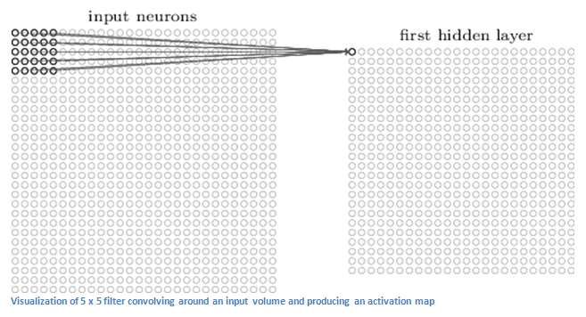
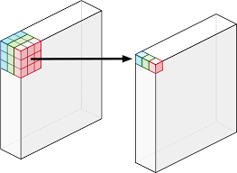
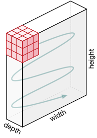
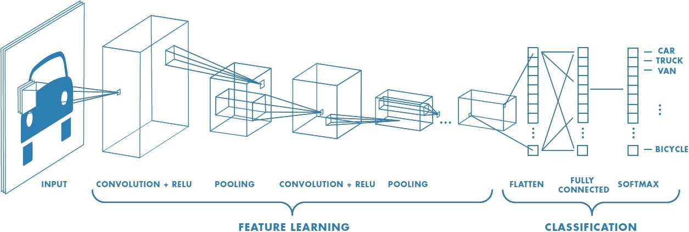
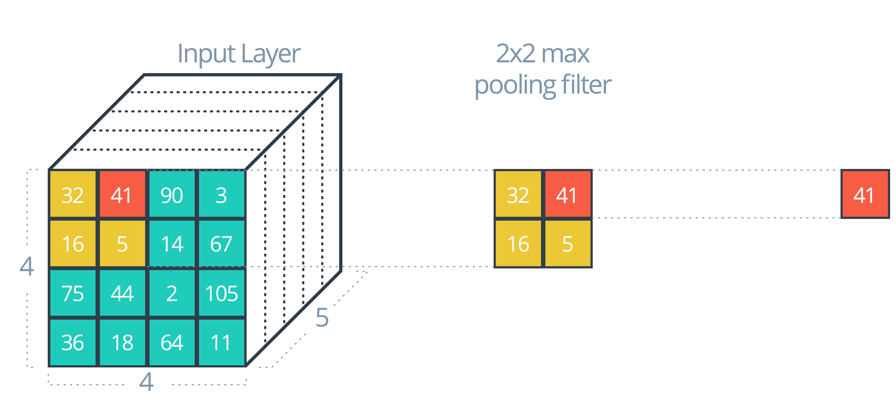
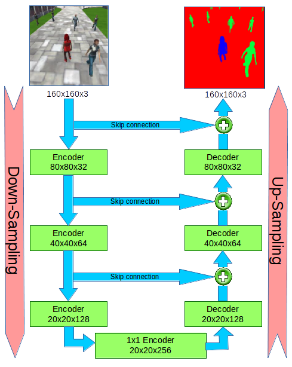
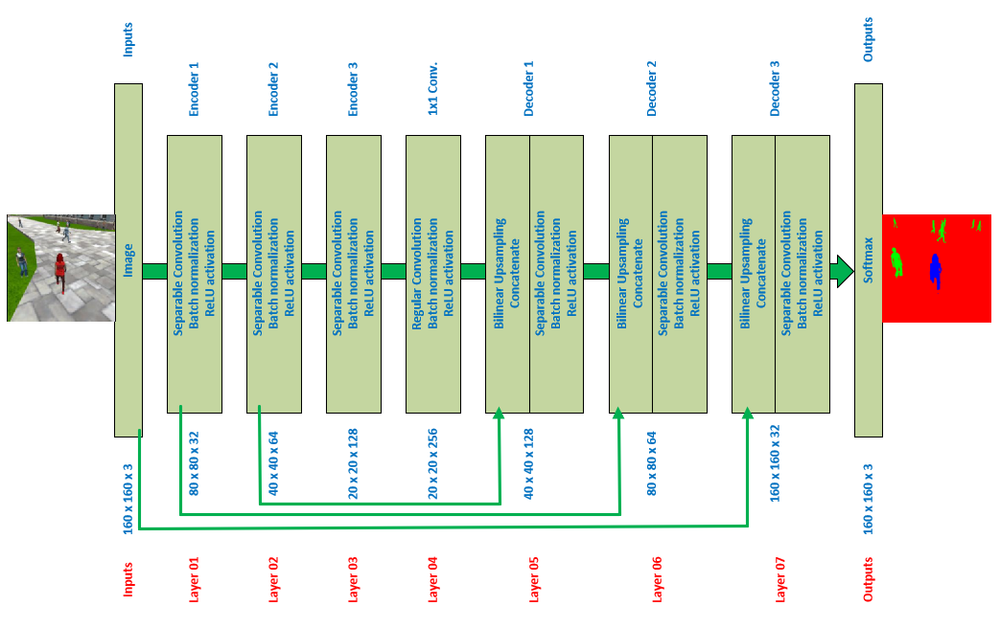

[](https://www.udacity.com/robotics)

# Project : Deep Learning Follow Me

Writeup by Peng Xu

Nov 2018

## 1. Overview

In this project we will train a fully convolutional (FCN) deep neural network to identify and track a target in simulation. So-called “follow me” applications like this are key to many fields of robotics and the very same techniques you apply here could be extended to scenarios like advanced cruise control in autonomous vehicles or human-robot collaboration in industry.

<p align="center">  </p>

## 2. Concept

### Fully Convolutional Network (FCN)

A normal convolutional neural network layer (**CNN layer**) with a **2D** Kernal size (5x5) looks like following:

<p align="center">  </p>

A **CNN layer** with a **3D** Kernal size (3x3x3) will look like this:

<p align="center">  </p>

In each layer (2D or 3D), the kernal will be moving accross inputs in a predefined stride and record a context (as output) in each move:

<p align="center">  </p>

A CNN might have several layers, each layer might capture a different level in the hierarchy of objects. The first layer is the lowest level in the hierarchy, where the CNN generally classifies small parts of the image into simple shapes like horizontal and vertical lines and simple blobs of colors. The subsequent layers tend to be higher levels in the hierarchy and generally classify more complex ideas like shapes (combinations of lines), and eventually full objects like cars.

A CNN with multiple CNN layers will look as following:

<p align="center">  </p>

CNNs are usually used to classify objects inside an image as shown above, the output is a class of car, truck, van, etc.

A **Fully Convolutional neural network (FCN)** is based on a normal CNN, where the last fully connected layer (classification layer) is substituted by another 1x1 convolution layer with a large "receptive field". The idea here is to capture the global context of the scene and enable us to tell what the objects are **and where they are located** in the scene. The output will be scene segmentation but not only object classification as it is in CNN applications.

The structure of FCN is divided into two parts, **convolution or encoder** part which will extract features from the image and **deconvolution or decoder** part which will upscale the output of the encoder (or reverse the convolution) so that the shape and location are restored in the original the image.

<p align="center">  </p>

A **1x1 convolution** simply maps an input pixel with all its channels to an output pixel, without looking at anything around the pixel. It is often used to reduce the number of depth channels, since it is often very slow to multiply volumes with extremely large depths.

When we convert our last fully connected (FC) layer of the CNN to a **1x1** convolutional layer we choose our new conv layer to be big enough so that it will enable us to have this localization effect scaled up to our original input image size then activate pixels to indicate objects and their approximate locations in the scene as shown in above figure. replacement of fully-connected layers with convolutional layers presents an added advantage that during inference (testing your model), you can feed images of any size into your trained network.

One problem with this approach is that we **lose some information** every time we do convolution (**encoding or down-sampling**); we keep the smaller picture (the local context) and lose the bigger picture (the global context) for example if we are using max-pooling to reduce the size of the input, and allow the neural network to focus on only the most important elements. Max pooling does this by only retaining the maximum value for each filtered area, and removing the remaining values.

<p align="center">  </p>

To solve this problem we also get some activation from previous layers (What we call **skip connections**)and sum/interpolate them together with the **up-sampled** outputs when **decoding** from the previous layer as shown in below diagram.

<p align="center">  </p>

**Bilinear Upsampling** by a factor of 2 is generally used in the **decoder blocks** to recover resolution then add it together with the previous encoders layers outputs to get the required up-size. Different factors of upsampling can be used if required.

**Batch normalization** is also used in each FCN layer and it is based on the idea that, instead of just normalizing the inputs to the network, we normalize the inputs to layers within the network. It's called "batch" normalization because during training, we normalize each layer's inputs by using the mean and variance of the values in the current mini-batch. Batch normalization presents us with few advantages: Networks train faster, higher learning rates,Simplifies the creation of deeper networks, and provides a bit of regularization.

In summary, FCN is consisting of the following components:

* **Encoder blocks**: that will take inputs from previous layers, compress it down to a context losing in the way some of the resolution (the bigger picture).

* **1x1 Convolution block**: that will reduce depth and capture the global context of the scene.

* **Decoder blocks**: that will take inputs from previous layers, decompress it, by up-sampling and adding inputs from previous encoder blocks through skip connections to recover some of the lost information hence do the precise segmentation.

* **Softmax activation**: normal convolution layer takes outputs from last decoder block and activate output pixels to indicate class and location of objects (semantic segmentation).

### FCN Application on Semantic Segmantation

Traditional convolutional networks (**CNN**) are having fully connected layers at the end (as shown above) hence cannot manage different input sizes, where as fully convolutional networks (**FCN**) can have **only convolutional layers** or layers which can manage different input sizes and are faster at that task. This is possible because output depends only on the local area of input. So input can be of arbitrary size and produce correspondingly-sized output with efficient inference and learning.

For this project we will be using FCN for semantic segmentation, however there are many other uses such us scene understanding in which multiple decoders are used to extract multiple meanings from the same trained model.

## 3. Implementation

### Data Collecting

I did not record any data from simulator, I was able to do all required steps using the provided Training, Validation, and Sample Evaluation Data.

<table><tbody>
    <tr><th align="center" colspan="3"> Data Set</td></tr>
    <tr><th align="center">Folder</th><th align="center">Content</th></tr>
    <tr><td align="left">/data/train_combined</td><td align="left">4,131 images + 4,131 masks</td></tr>
    <tr><td align="left">/data/validation</td><td align="left">1,184 images + 1,184 masks</td></tr>    
    <tr><td align="left">/data/sample_evalution_data/following_images</td>
       <td align="left">542 images + 542 masks</td></tr><tr>
    <td align="left">/data/sample_evalution_data/patrol_non_targ</td>
       <td align="left"> 270 images + 270 masks</td></tr><tr>
    <td align="left">/data/sample_evalution_data/patrol_with_targ</td>
       <td align="left"> 322 images + 322 masks</td></tr>
</tbody></table>

### Building the Model

I will go through some code blocks to explain how I build the neural network model using TensorFlow.

#### Separable convolution layer:

Separable convolution layers with same padding will be used in all encoder blocks of the FCN. After the ReLU activation function and the batch normalization it outputs, as shown below,

```python
def separable_conv2d_batchnorm(input_layer, filters, strides=1):
    output_layer = SeparableConv2DKeras(filters=filters,kernel_size=3, strides=strides,
                             padding='same', activation='relu')(input_layer)

    output_layer = layers.BatchNormalization()(output_layer)
    return output_layer
```

#### Regular Conv layer:

Regular convolution block is used for 1x1 convolution with batch normalization and Relu activation.

```python
def conv2d_batchnorm(input_layer, filters, kernel_size=3, strides=1):
    output_layer = layers.Conv2D(filters=filters, kernel_size=kernel_size, strides=strides,
                      padding='same', activation='relu')(input_layer)

    output_layer = layers.BatchNormalization()(output_layer)
    return output_layer
```

#### Bilinear Upsampling layer

Used in all decoder blocks; Upsampling by a factor of 2 is generally recommended, but we can try out different factors as well.

```python
def bilinear_upsample(input_layer):
    output_layer = BilinearUpSampling2D((2,2))(input_layer)
    return output_layer
```

#### Encoder Blocks

3 Encoder blocks are used, each encoder block is consisting of one separable convolution layer that is having batch normalization and ReLU activation function.

```python
def encoder_block(input_layer, filters, strides):

    # Create a separable convolution layer using the separable_conv2d_batchnorm() function.
    output_layer = separable_conv2d_batchnorm(input_layer, filters, strides)

    return output_layer
```

#### Decoder Blocks

3 decoder blocks are used, each decoder block is consisting of Upsampler to collect input from a previous layer with smaller size, a concatenate function to add upsampled layer to the input of decoder then pass the resulting output to two layers of separable conv+batch normalization+ReLU activation function.

```python
def decoder_block(small_ip_layer, large_ip_layer, filters):

    # Upsample the small input layer using the bilinear_upsample() function.
    upsampled_small_ip_layer = bilinear_upsample(small_ip_layer)

    # Concatenate the upsampled and large input layers using layers.concatenate
    output_layer = layers.concatenate([upsampled_small_ip_layer, large_ip_layer])

    # Add some number of separable convolution layers
    output_layer = separable_conv2d_batchnorm( output_layer, filters, strides=1)
    output_layer = separable_conv2d_batchnorm( output_layer, filters, strides=1)

    return output_layer
```

#### Softmax activation

Last layer in FCN is regular convolution layer with softmax activation and same padding:

```python
    outputs = layers.Conv2D(num_classes, 1, activation='softmax', padding='same')(layer07)
```

#### Put all together to the FCN model:

Below is the code calling blocks explained above, I have added a print function after each block to help showing the size of each layer in the model.

```python
def fcn_model(inputs, num_classes):

    # Add Encoder Blocks.
    # Remember that with each encoder layer, the depth of your model (the number of filters) increases.
    print("Inputs  shape:",inputs.shape, "  \tImage Size in Pixels")

    layer01 = encoder_block(inputs , filters=32 , strides=2)
    print("layer01 shape:",layer01.shape, "  \tEncoder Block 1")

    layer02 = encoder_block(layer01, filters=64 , strides=2)
    print("layer02 shape:",layer02.shape, "  \tEncoder Block 2")

    layer03 = encoder_block(layer02, filters=128, strides=2)
    print("layer03 shape:",layer03.shape, "\tEncoder Block 3")

    # Add 1x1 Convolution layer using conv2d_batchnorm().
    layer04 = conv2d_batchnorm(layer03, filters=256, kernel_size=1, strides=1)
    print("layer04 shape:",layer04.shape, "\t1x1 Conv Layer")

    # Add the same number of Decoder Blocks as the number of Encoder Blocks
    layer05 = decoder_block(layer04, layer02, filters=128 )
    print("layer05 shape:",layer05.shape, "\tDecoder Block 1")

    layer06 = decoder_block(layer05, layer01, filters=64  )
    print("layer06 shape:",layer06.shape, "  \tDecoder Block 2")

    layer07 = decoder_block(layer06, inputs , filters=32  )
    print("layer07 shape:",layer07.shape, "\tDecoder Block 3")

    # The function returns the output layer of your model.
    # "layer07" is the final layer obtained from the last decoder_block()

    outputs = layers.Conv2D(num_classes, 1, activation='softmax', padding='same')(layer07)
    print("Outputs shape:",outputs.shape, "\tOutput Size in Pixel")

    return outputs
```

And the FCN model diagram is as shown below:

<p align="center">  </p>

### Hyper-Parameter Tuning:

In the following sections I will explain how I tuned each parameter:

#### Batch Size:

Batch Size indicates the number of training samples/images that get propagated through the network in a single pass. On my Dell PC, I was always getting the "**ResourceExhaustedError**" error until I switched the batch size to **16**.

#### Workers:

Workers defines the maximum number of processes to spin up. I didn't challenge this since the performance satisfied me just well. SO I simply kept it as 2.

#### Steps Per Epoch:

Steps Per Epoch means the number of batches of training images that go through the network in 1 epoch. One recommended value to try would be based on the total number of images in training dataset divided by the batch_size.

```
steps_per_epoch = 4131/16 = 258.1875 **aprox. 259**
```

#### Validation Steps:

Validation Steps means the number of batches of validation images that go through the network in 1 epoch. This is similar to steps_per_epoch, except validation_steps is for the validation dataset.

```
validation_steps=1184/20=74 **aprox. 74**
```

#### Learning Rate:

Learning Rate is the parameter that controls the size of weight and bias changes in each learning step. Among the trials, **0.005** stood out since it allowed to converge to a satisfying accuracy with a considerable speed.

#### Number of Epochs:

Number of Epochs shows the number of times the entire training dataset gets propagated through the network. I increased it to **50** since it made the accuracy met the rubric.

### Evaluation

We will be using the IoU to calculate the final score.

**IoU** is Intersection over Union, where the Intersection set is an **AND** operation (pixels that are truly part of a class AND are classified as part of the class by the network) and the Union is an **OR** operation (pixels that are truly part of that class + pixels that are classified as part of that class by the network).

<p align="center">  </p>

Sum all the true positives, etc from the three datasets to get a weight for the score: **0.7341490545050056**

The IoU for the dataset that never includes the hero is excluded from grading: **0.561794675106**

The Final Grade Score is the pixel wise:

```
average_IoU*(n_true_positive/(n_true_positive+n_false_positive+n_false_negative))
```

So the score is: **0.4159221490946398**

### Testing Model in the Simulator

I have selected the best model from the above mentioned and copied it to the code folder, started the simulator, then ran the following command to test the model in simulator:

```bash
$ python3 follower.py --pred_viz model_weights
```
The recording of the test is on the following YouTube link

[]()

## HTML version of model_training.ipynb notebook

HTML version of the model_training.ipynb notebook is on this [link](./model_training.html)

## References:

* http://iamaaditya.github.io/2016/03/one-by-one-convolution/

* http://deeplearning.net/software/theano/tutorial/conv_arithmetic.html

* https://stats.stackexchange.com/questions/194142/what-does-1x1-convolution-mean-in-a-neural-network

* https://www.quora.com/What-is-an-Encoder-Decoder-in-Deep-Learning/answer/Christian-Baumgartner-3?srid=ison

* https://courses.cs.washington.edu/courses/cse576/17sp/notes/Sachin_Talk.pdf

* https://leonardoaraujosantos.gitbooks.io/artificial-inteligence/content/image_segmentation.html

* https://hackernoon.com/autoencoders-deep-learning-bits-1-11731e200694

* http://blog.qure.ai/notes/semantic-segmentation-deep-learning-review

* https://wiki.tum.de/display/lfdv/Image+Semantic+Segmentation

* http://warmspringwinds.github.io/tensorflow/tf-slim/2016/11/22/upsampling-and-image-segmentation-with-tensorflow-and-tf-slim/
